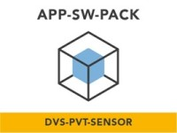
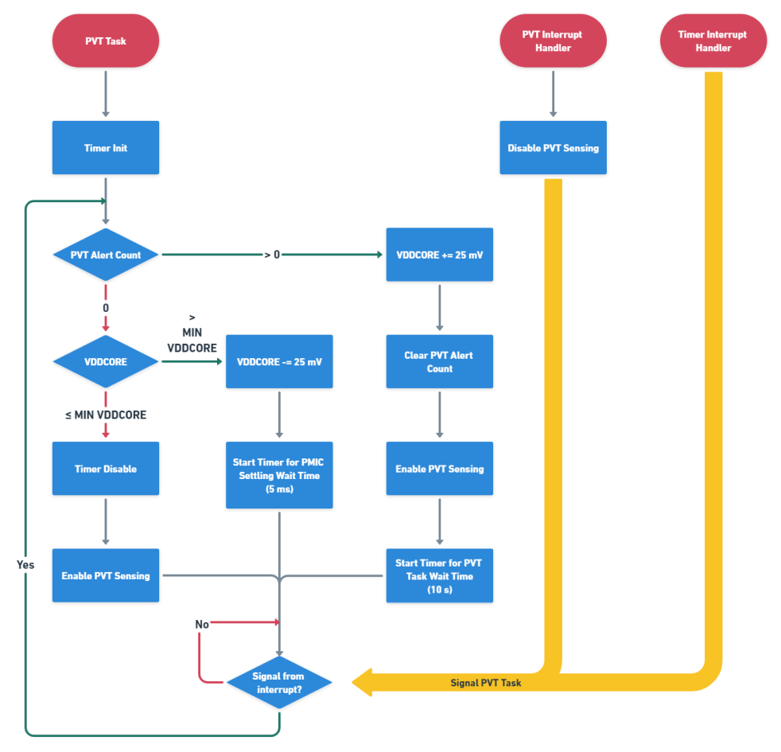

# NXP Application Code Hub
[](https://www.nxp.com)

## DVS With Internal PVT Sensor
This application showcase the dynamic voltage scaling (DVS) capabilities of i.MX RT500 using the internal PVT sensor.

#### Boards: EVK-MIMXRT595
#### Categories: Low power, Power conversion
#### Peripherals: CLOCKS, I2C, TIMER, UART
#### Toolchains: MCUXpresso IDE

<p align="center">
	
</p>

## Table of Contents
1. [Resources](#step1)
2. [Assemble the Application](#step2)
3. [Build and Run the Application](#step3)
4. [Application Overview](#step4)
5. [Other Reference Applications](#step5)
6. [Support](#step6)
7. [Release Notes](#step7)


## 1. Resources<a name="step1"></a>
* Purchase supported board.
    * [MIMXRT595-EVK](https://www.nxp.com/design/development-boards/i-mx-evaluation-and-development-boards/i-mx-rt595-evaluation-kit:MIMXRT595-EVK)
* Install [MCUXpresso IDE v11.6.0+](https://www.nxp.com/design/software/development-software/mcuxpresso-software-and-tools-/mcuxpresso-integrated-development-environment-ide:MCUXpresso-IDE).
* [Application Note AN13695](https://www.nxp.com/doc/AN13695) - Covers technical details of the software pack.
* [Lab Guide](https://github.com/NXPmicro/appswpacks-dvs-pvt-sensor/blob/mcux_release_github/dvs_pvt_sensor/app/evkmimxrt595/doc/evkmimxrt595_dvs_pvt_sensor_lab_guide.pdf) and [Video Walkthrough](https://www.nxp.com/pages/:TIP-APP-SW-PACK-DYNAMIC-VOLTAGE) - Walks you through downloading, importing, and running the software pack.

## 2. Assemble the Application<a name="step2"></a>
You need to have both Git and [West](https://docs.zephyrproject.org/latest/develop/west/index.html) installed, then execute below commands to gather the whole APP-SW-PACKS/DVS-PVT-SENSOR delivery at revision ```${revision}``` and place it in a folder named ```appswpacks_dvs_pvt_sensor```.
```
west init -m https://github.com/nxp-appcodehub/ap-dvs-pvt-sensor.git --mr ${revision} appswpacks_dvs_pvt_sensor
cd appswpacks_dvs_pvt_sensor
west update
```
Replace ```${revision}``` with any SDK revision you wish to achieve. This can be ```mcux_release_github``` if you want the latest state, or any commit SHA.

## 3. Build and Run the Application<a name="step3"></a>
To build and run the application please refer to the lab guide or check the steps in [Run a project using MCUXpresso IDE](https://github.com/NXPmicro/mcux-sdk/blob/main/docs/run_a_project_using_mcux.md).

## 4. Application Overview<a name="step4"></a>
This software application pack demonstrates the use of the PVT sensor on i.MX RT500 to implement dynamic voltage scaling (DVS).

After initializing the necessary hardware, it launches the following tasks:
1. **Workload Task:** Runs Coremark for ~10 seconds, prints the results, and then delays for 5 seconds to allow the FreeRTOS idle task to enable deep sleep mode.
2. **PVT Task:** The PVT task is in charge of handling DVS in the application. The general flow of the task is shown below. \


## 5. Other Reference Applications<a name="step5"></a>
For other rapid-development software bundles please visit the [Application Software Packs](https://www.nxp.com/appswpack) page.

## 6. Support<a name="step6"></a>
Questions regarding the content/correctness of this example can be entered as Issues within this GitHub repository.

#### Project Metadata
<!----- Boards ----->
[](https://github.com/search?q=org%3Anxp-appcodehub+EVK-MIMXRT595+in%3Areadme&type=Repositories)

<!----- Categories ----->
[](https://github.com/search?q=org%3Anxp-appcodehub+low_power+in%3Areadme&type=Repositories) [](https://github.com/search?q=org%3Anxp-appcodehub+power_conversion+in%3Areadme&type=Repositories)

<!----- Peripherals ----->
[](https://github.com/search?q=org%3Anxp-appcodehub+clocks+in%3Areadme&type=Repositories) [](https://github.com/search?q=org%3Anxp-appcodehub+i2c+in%3Areadme&type=Repositories) [](https://github.com/search?q=org%3Anxp-appcodehub+timer+in%3Areadme&type=Repositories) [](https://github.com/search?q=org%3Anxp-appcodehub+uart+in%3Areadme&type=Repositories)

<!----- Toolchains ----->
[](https://github.com/search?q=org%3Anxp-appcodehub+mcux+in%3Areadme&type=Repositories)

Questions regarding the content/correctness of this example can be entered as Issues within this GitHub repository.

>**Warning**: For more general technical questions regarding NXP Microcontrollers and the difference in expected funcionality, enter your questions on the [NXP Community Forum](https://community.nxp.com/)

[](https://www.youtube.com/@NXP_Semiconductors)
[](https://www.linkedin.com/company/nxp-semiconductors)
[](https://www.facebook.com/nxpsemi/)
[](https://twitter.com/NXP)

## 7. Release Notes<a name="step7"></a>
| Version | Description / Update                           | Date                        |
|:-------:|------------------------------------------------|----------------------------:|
| 1.0     | Initial release on Application Code Hub        | August 17<sup>th</sup> 2023 |
