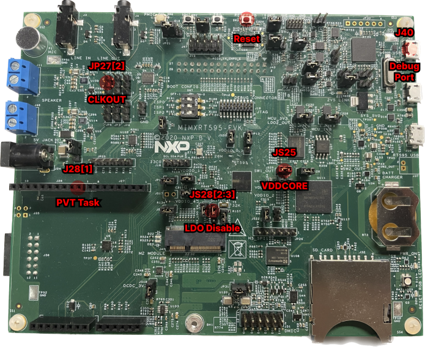

# Overview
The application first initializes the main_clk to use FRO 192 MHz and sets the CPU divider to 1, meaning that the core frequency is set to 192 MHz. Next, it initializes the PVT sensor by doing the following:
1. Sets VDDCORE to 0.9V.
2. Reads the PVT delay from OTP or the PVT ring oscillator.
3. Enables the PVT interrupt.
4. Enables the PVT alert counter. This tells you the amount of times the PVT interrupt has triggered.
5. Sets the PVT delay.
6. Starts the PVT sensing.

It finally launches the tasks described in the README.md located in the main repo.

# Toolchain supported
- MCUXpresso  11.6.0+

# Hardware requirements
- Mini/micro USB cable
- MIMXRT595-EVK
- Personal Computer

# Board settings
Make sure the following jumpers are on:
1. **JS25 : VDDCORE**
2. **JS28[2:3] : LDO Disable**

The following pins can be used to profile the application:
1. **JP27[2] : CLKOUT (Core Frequency / 200)** 
2. **JS25    : VDDCORE**
3. **J28[1]  : PVT Task Profiling**



# Prepare the Demo
1.  Connect a USB cable between the host PC and J40 on the target board. 
2.  Open a serial terminal with the following settings:
    - 115200 baud rate
    - 8 data bits
    - No parity
    - One stop bit
    - No flow control
3. Set the terminal new-line receive setting to Auto. This needs to be done so that Coremark results print correctly.
	- If you are using TeraTerm, this can be found under Setup -> Terminal...
3.  Download the program to the target board.
4.  Either press the reset button on your board or launch the debugger in your IDE to begin running the demo.

# Running the demo
After the board is flashed the terminal will print **"PVT Application Software Pack"** and the application will start.

**Example output:**
```
PVT Application Software Pack

This application uses the PMIC.
Make sure JS28 is set to [2:3] and JS25 is on.

You can monitor the following:
    JP27[2]: core frequency/200
    JS25[1]: VDDCORE
    J28[1] : PVT Task

PVT Lib Version = 0x010000
SILICON_REV_ID = B:2
UUID = 0x97C18974_CBAF8B80_591741EF_870A394F

NOTE: Coremark is not optimized. Score should only be used to  check the impact of enabling the PVT task on app performance.

WARNING: Reading delay from Ring Osc. Make sure the following  are met:
    VDDCORE     == 0.9V
    Temperature == 25C

Press ENTER to continue

Ring Osc. Delay = 30

Press ENTER to start application.

Starting Application. Coremark will print results every 10-20s.
2K performance run parameters for coremark.
CoreMark Size    : 666
Total ticks      : 2210
Total time (secs): 11.050000
Iterations/Sec   : 117.647059
Iterations       : 1300
Compiler version : GCC10.3.1 20210824 (release)
Compiler flags   : -O0
Memory location  : STACK
seedcrc          : 0xe9f5
[0]crclist       : 0xe714
[0]crcmatrix     : 0x1fd7
[0]crcstate      : 0x8e3a
[0]crcfinal      : 0x382f
Correct operation validated. See README.md for run and reporting rules.
CoreMark 1.0 : 117.647059 / GCC10.3.1 20210824 (release) -O0 / STACK
--------------------------
Optimized VDDCORE = 825mV

--------------------------
```


 
